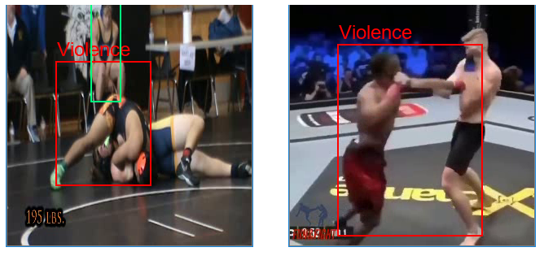

# ViolenceDetectionAndLocalization
 A Violence Detectot with localization , part of A graduation project submited to Birzeit University
 
 
  
## How to run

1. Download the Pre-trained models Kinetics model and lables and the TensorFlow .pb , .pptxt files from [here](https://u.pcloud.link/publink/show?code=kZlcALXZplDJ4el6eKjNYLPcbHGXsX7qmfV7).

All models are trained on Kinetics-400 and coco dataset. 

2. Extract the Downloaded files to 
>	| ViolenceDetectionAndLocalization
> >     resnet-34_kinetics.onnx
> >		inference_gragh
> > > 		frozen_inference_graph.pb
> > > 		labelmap.pbtxt
